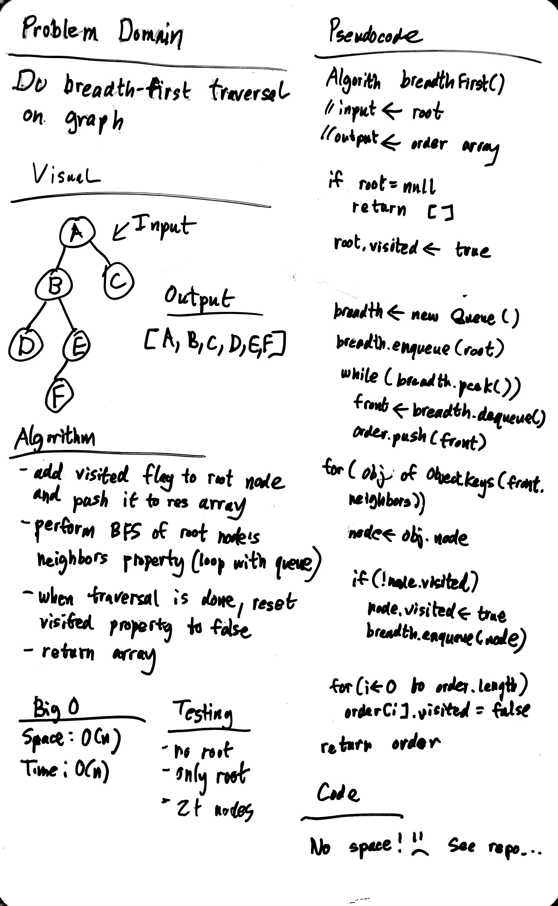

# Breadth First Graph

"Bread first" - Amanda Iverson

## Challenge

Implement a breadth-first traversal on a graph.

## Approach & Efficiency

### Algorithm

- use a queue for breadth first traversal as one would with a binary tree
- mark each node with a visited boolean flag to prevent infinite loops
- loop through visited nodes one final time and mark visited as false

### Big O:

- Time: O(N)
- Space: O(N)

## Solution

