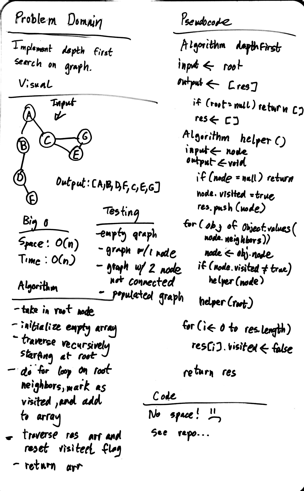

# Depth First Graph

## Challenge

Conduct a depth first preorder traversal on a graph

## Approach & Efficiency

### Algorithm

- initialize empty res array
- create helper function that takes in a node
- call helper function, passing in root
- set current node's visited property to true and add to res array
- loop through current node's neighbors, calling recursively if not visited
- after helper function is finished, loop again through res array and reset visited to false
- return res array

### Big O:

- Time: O(N \* M), where N is number of node's and M is additional time scanning neighbors
- Space: O(N)

## Solution

