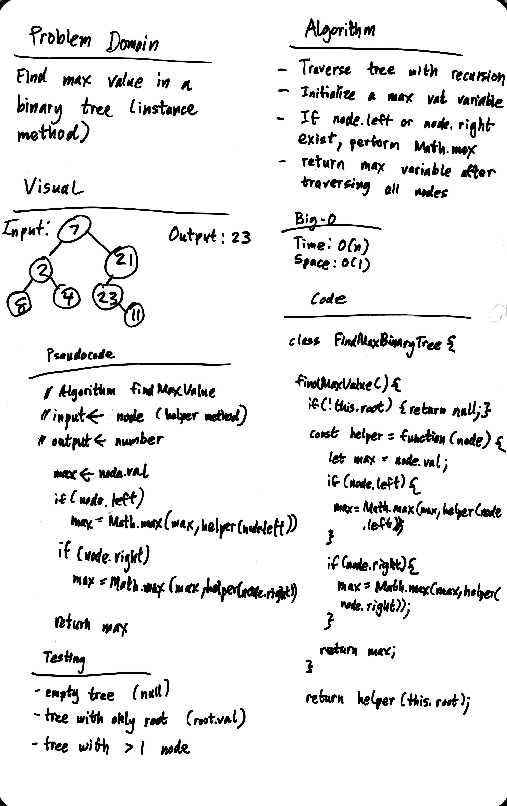

# Find Maximum Value in a Binary Tree

Yes.

## Challenge

    Write an instance method called find-maximum-value. Without utilizing any of the built-in methods available to your language, return the maximum value stored in the tree. You can assume that the values stored in the Binary Tree will be numeric.

## Approach & Efficiency

1. create recursive helper function that takes in a node
2. return max value of node, node.left, and node.right
3. return -Infinity for null nodes (not show in whiteboard, but present in code refactor)

### Big O:

- Time: O(N)
- Space: O(1)

## Solution

