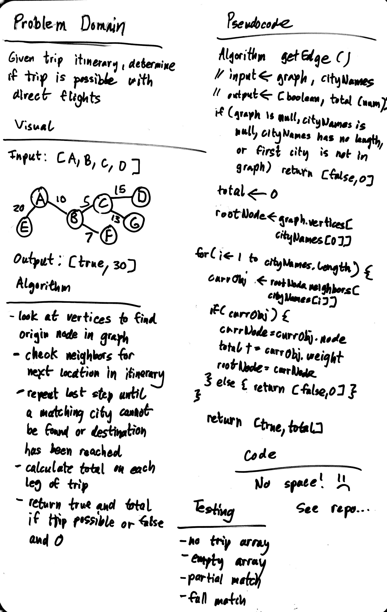

# Get Edges

## Challenge

Given a business trip itinerary, and an Alaska Airlines route map, is the trip possible with direct flights? If so, how much will the total trip cost be?

## Approach & Efficiency

### Algorithm

- find first city and establish it as root node
- look at its neighbors to see if next city is connected
- get edge weight and increment it to a total variable;
- repeat process until trip fails or last city is reached
- if path is valid, return true with the total, else return false and 0

### Big O:

- Time: O(N)
- Space: O(N)

## Solution

