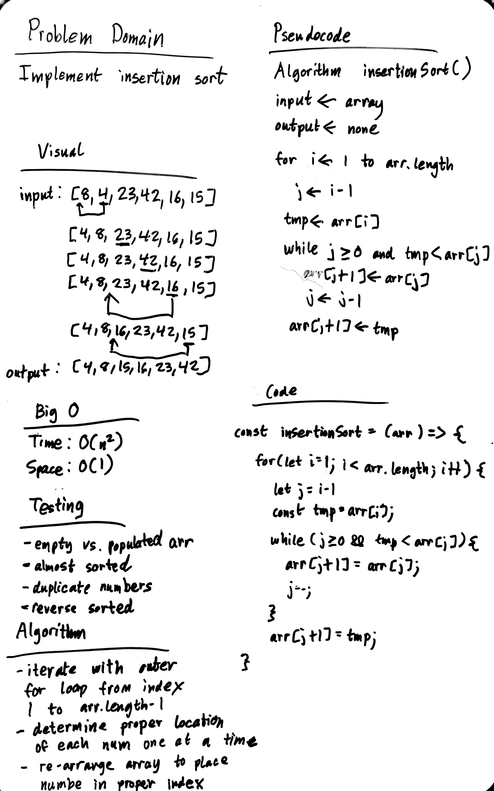

# Insertion Sort

Insertion sort is a sorting algorithm the existing array one item at a time. It takes the element, finds out where it belongs, and places it in the proper sorted location.

## Pseudocode

```
  InsertionSort(int[] arr)

    FOR i = 1 to arr.length

      int j <-- i - 1
      int temp <-- arr[i]

      WHILE j >= 0 AND temp < arr[j]
        arr[j + 1] <-- arr[j]
        j <-- j - 1

      arr[j + 1] <-- temp
```

## Walkthrough



## Efficiency
- Time: O(n^2)
- Space: O(1)