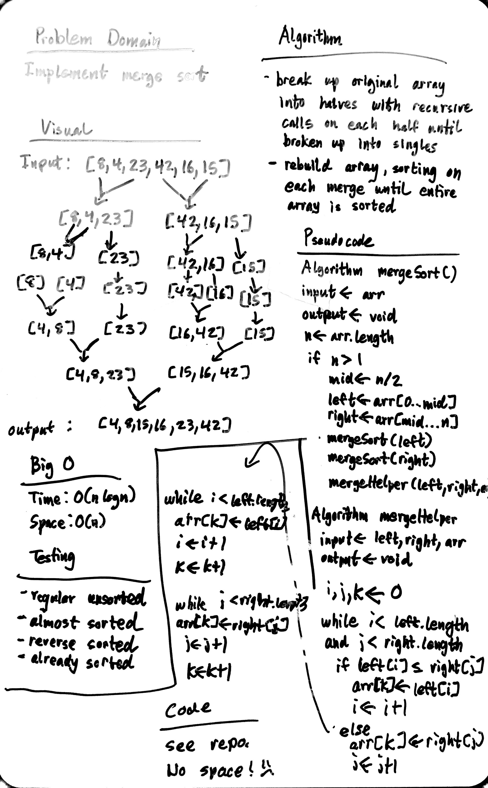

# Merge Sort

Implement merge sort

## Challenge

1. Provide a visual step through for each of the sample arrays based on the provided pseudo code
2. Convert the pseudo-code into working code in your language
3. Present a complete set of working tests

## Approach & Efficiency

### Algorithm

1. cut current array into 2 smaller arrays
2. make recursive call each of the smaller arrays
3. call a helper function with both halves and original array as input
4. within helper, re-assign original array values by looking at which among the left and right arrays at a given index has a smaller value
5. repeat above until the entire original array has been sorted

### Big O:

- Time: O(n logn)
- Space: O(n)

## Solution

