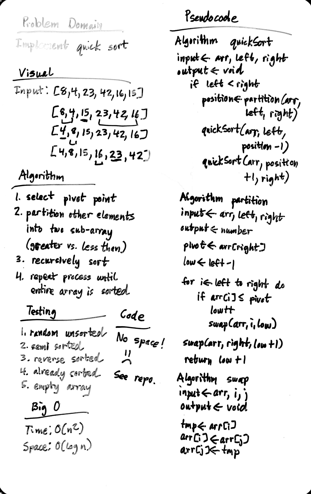

# Quick Sort

Implement quick sort

## Challenge

1. Provide a visual step through for each of the sample arrays based on the provided pseudo code
2. Convert the pseudo-code into working code in your language
3. Present a complete set of working tests

## Approach & Efficiency

### Algorithm

1. select pivot element in array
2. partition other elements into two suby-arrays (greater vs. less than pivot)
3. recursively sort
4. repeat process until entire array is sorted

### Big O:

- Time: O(n^2)
- Space: O(log n)

## Solution

