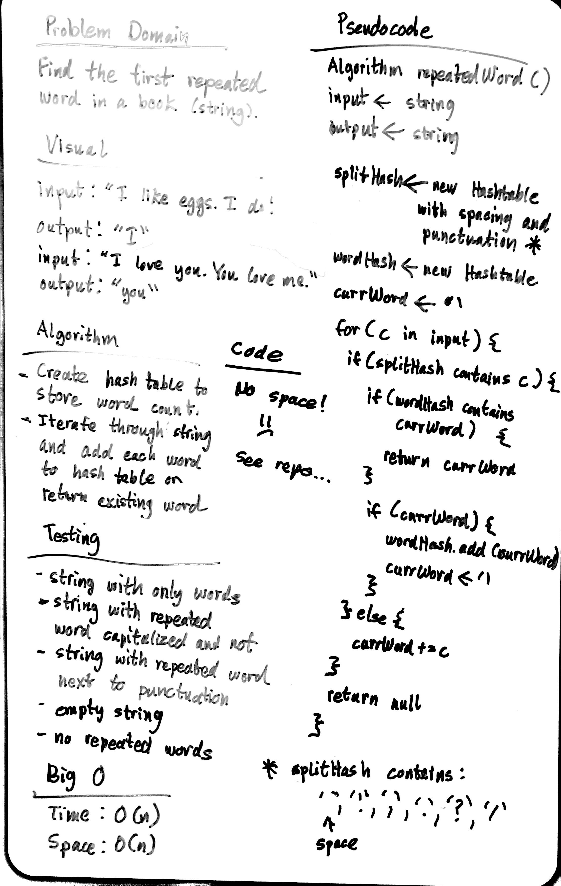

# First Repeated Word

Find the first repeated word in a book.

## Challenge Description

- Write a function that accepts a lengthy string parameter.
- Without utilizing any of the built-in library methods available to your language, return the first word to occur more than once in that provided string.

## Approach & Efficiency

### Approach

- create a hash table to hold punctuation
- create a hash table to hold word count
- create dummy variable to hold current word initializing to an empty string
- iterate through string, adding each char to the variable and add to hashtable if punctuation or space is found
- during iteration, search for existing word and return it if it already exists in table
- return null for both empty strings and no repeated words in a string

### Efficiency

- Space: O(n)
- Time: O(n)

## Solution

