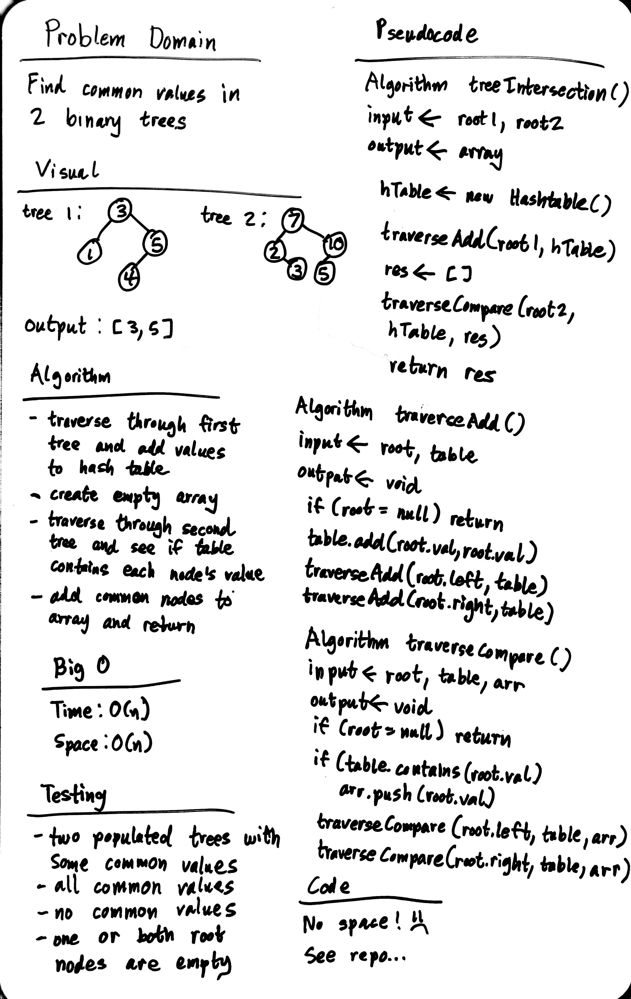

# Tree Intersection

Find common values in 2 binary trees.

## Challenge Description

- Write a function called tree_intersection that takes two binary tree parameters.
- Without utilizing any of the built-in library methods available to your language, return a set of values found in both trees.

## Approach & Efficiency

### Approach

- traverse through first tree and add values to hash table
- traverse through second tree and see if values are in hash table
- during second traversal, add value to an array if it found in hash table
- return resulting array

### Efficiency

- Space: O(n)
- Time: O(n)

## Solution

